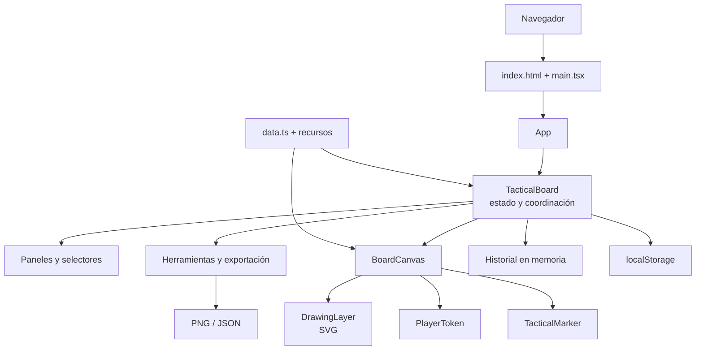

# Documentación técnica

## 1. Objetivo y alcance

SMITE 2 Tactical Board es una aplicación web de una sola página (SPA) para crear y compartir planes tácticos de partidas de Conquest. Permite configurar dos equipos de cinco jugadores, colocar fichas y marcadores sobre distintas vistas del mapa, dibujar rutas y flechas, deshacer cambios y exportar o importar una estrategia.

La solución se ejecuta íntegramente en el navegador. No dispone de backend, base de datos, autenticación ni llamadas a servicios externos: el estado se conserva en el almacenamiento local del dispositivo y las exportaciones se generan en el cliente.

## 2. Tecnologías utilizadas

Las versiones exactas instaladas quedan fijadas en `package-lock.json`; `package.json` declara actualmente varias dependencias con la etiqueta `latest`.

| Área | Tecnología | Uso en la solución |
| --- | --- | --- |
| Interfaz | React 19 | Composición de la interfaz mediante componentes y gestión de estado con hooks. |
| Lenguaje | TypeScript 7 | Tipado estricto del dominio, propiedades de componentes y utilidades. |
| Renderizado | React DOM 19 | Montaje de la SPA en el elemento `#root`. |
| Construcción | Vite 8 | Servidor de desarrollo, transformación de TSX, gestión de recursos y bundle de producción. |
| Integración React | `@vitejs/plugin-react` | Transformación de JSX y soporte de React durante desarrollo y compilación. |
| Dibujo interactivo | SVG nativo | Visualización de trazos libres y flechas sobre una capa escalable. |
| Exportación gráfica | Canvas 2D | Composición de mapa, dibujos, fichas y marcadores en un PNG de 1600 × 1600. |
| Persistencia | Web Storage (`localStorage`) | Guardado automático del estado de la pizarra en el navegador. |
| Interacción | Pointer Events y HTML Drag and Drop | Movimiento de fichas y marcadores, dibujo compatible con ratón y entrada táctil, y arrastre desde la paleta. |
| Estilos | CSS | Diseño visual, distribución adaptable, estados interactivos y capas del tablero. |
| Pruebas | Vitest 4, Testing Library y jsdom | Pruebas unitarias de utilidades y pruebas de integración del flujo principal. |

La aplicación usa únicamente API nativas del navegador para persistir, importar y exportar. Esto reduce la infraestructura necesaria y permite desplegar el resultado como archivos estáticos.

## 3. Arquitectura de la solución

La arquitectura es una SPA basada en componentes, con estado centralizado en el componente contenedor `TacticalBoard`. Los componentes hijos reciben datos y callbacks mediante propiedades; no mantienen una copia independiente del estado del dominio.



### 3.1 Capas lógicas

1. **Presentación y entrada de usuario.** Los componentes de `src/components/` renderizan la interfaz y traducen eventos de puntero, teclado, formularios y arrastre en acciones.
2. **Coordinación y estado.** `TacticalBoard.tsx` contiene el estado principal, selecciona el modo de herramienta y coordina las operaciones de edición, historial, persistencia e importación/exportación.
3. **Dominio.** `types.ts` define el contrato `BoardState` y sus entidades; `data.ts` contiene catálogos, recursos y la fábrica del estado inicial.
4. **Servicios locales.** `utils.ts` agrupa normalización de coordenadas, validación, persistencia, historial y descarga; `exportBoard.ts` implementa los adaptadores de salida JSON y PNG.
5. **Plataforma.** Vite resuelve los módulos y recursos, compila la aplicación y produce el sitio estático de producción.

No existe una capa de red. El límite de la aplicación coincide con la pestaña del navegador y los archivos que el usuario importa o descarga.

## 4. Modelo de estado

`BoardState` es la única representación persistente de una estrategia:

```text
BoardState
├── version: 1
├── tacticName
├── mapId
├── tokens[10]
│   └── id, team, role, god?, size, x, y
├── markers[]
│   └── id, type, label, color, size, x, y
├── strokes[]
│   └── id, kind, points[], color, width, opacity
├── zoom
└── drawing
    └── color, width, opacity
```

Las posiciones se almacenan como coordenadas normalizadas entre `0` y `1`, no como píxeles. Esto desacopla los datos del tamaño visible del mapa y permite reutilizar el mismo estado en distintos tamaños de pantalla y en la exportación a 1600 × 1600.

El campo `version` permite identificar el formato persistido. La carga incorpora valores predeterminados para `zoom` y para el tamaño de fichas cuando recibe un estado v1 anterior a esos campos. Cualquier cambio incompatible adicional en el contrato debe introducir una nueva versión y una estrategia de migración o rechazo explícito.

## 5. Gestión de cambios e historial

El estado se envuelve en una estructura `History<BoardState>` con tres partes: `past`, `present` y `future`.

- `commit` registra el estado anterior en el historial, limita el pasado a 60 entradas y elimina la rama de rehacer.
- `preview` actualiza el estado presente sin crear una entrada. Se utiliza en interacciones continuas, como mover un objeto o ajustar controles.
- Al comenzar un arrastre se guarda una instantánea con `structuredClone`; al terminar se añade una sola entrada al historial si hubo cambios. Así, un gesto completo se deshace en una operación.
- `Ctrl/Cmd + Z` deshace y `Ctrl/Cmd + Mayús + Z` rehace.

El historial vive solo en memoria. La estrategia presente sí se persiste, pero las pilas de deshacer y rehacer se reinician al recargar la página.

## 6. Renderizado e interacción del tablero

`BoardCanvas` superpone varias capas dentro del mapa:

1. imagen base de la vista seleccionada;
2. zonas visuales de ambos equipos;
3. capa SVG de dibujos;
4. capa de objetos con fichas y marcadores;
5. información del modo activo.

`DrawingLayer` emplea un `viewBox` de 1000 × 1000 y transforma las coordenadas normalizadas a ese espacio. Durante el gesto conserva un trazo provisional en estado local y solo lo incorpora a `BoardState` al finalizar. El borrador calcula la distancia entre el puntero y los segmentos existentes y elimina el trazo superior que esté dentro del umbral.

Las fichas y los marcadores usan captura de puntero para mantener el arrastre aunque el cursor salga del elemento. También se pueden mover con las flechas del teclado en incrementos normalizados, y sus posiciones se limitan para evitar que queden fuera del tablero.

El mapa admite zoom entre 100 % y 300 %. `BoardCanvas` mantiene el punto central visible al cambiar de escala y delega el desplazamiento al contenedor con scroll. El tamaño de cada ficha forma parte de su estado y se ajusta desde el selector de dios.

Los marcadores pueden colocarse manualmente o alinearse con ubicaciones conocidas del mapa. El catálogo `LANDMARKS` define objetivos, torres, fénix y titanes en coordenadas normalizadas, incluidas sus posiciones simétricas para ambos equipos.

## 7. Persistencia, importación y exportación

### Persistencia local

Después de cada cambio, un efecto con 250 ms de espera serializa el estado actual en `localStorage` bajo la clave `smite2-tactical-board:v1`. Al iniciar, la aplicación recupera y valida ese valor; si falta, está corrupto o no cumple el contrato, utiliza un estado inicial seguro.

El guardado es local al navegador, perfil y origen web. No sincroniza datos entre dispositivos y puede perderse si se borra el almacenamiento del sitio.

### JSON

La exportación JSON descarga `BoardState` con formato legible. La importación trata el archivo como `unknown` y lo acepta solo después de validar versión, tipos, rangos, cantidades máximas y coordenadas. Esta validación protege la coherencia del estado, aunque el archivo proceda de fuera de la aplicación.

### PNG

La exportación PNG vuelve a dibujar la estrategia en un `canvas` de 1600 × 1600. Carga el mapa y los retratos, pinta los trazos, fichas, marcadores, etiquetas y cabecera, genera un `Blob` y crea una descarga local. No captura el DOM ni envía el contenido a un servidor.

## 8. Recursos estáticos

- Los mapas se encuentran en la raíz y se importan desde `data.ts`.
- Los iconos de rol están en `roles/`.
- Los retratos están en `gods/` y se descubren durante la construcción mediante `import.meta.glob`.
- Las ubicaciones conocidas del mapa se declaran como datos tipados en `data.ts`.
- Vite convierte estas importaciones en URLs versionadas en el bundle de producción.

Añadir un retrato JPG a `gods/` lo incorpora automáticamente al selector. Su nombre visible se deriva del nombre del archivo y se ordena según la configuración regional española.

## 9. Estructura del código

```text
.
├── index.html                 Documento de entrada
├── src/
│   ├── main.tsx               Montaje de React
│   ├── App.tsx                Raíz de la aplicación
│   ├── components/            Componentes visuales e interactivos
│   ├── types.ts               Modelo de dominio
│   ├── data.ts                Catálogos, recursos y estado inicial
│   ├── utils.ts               Validación, historial y persistencia
│   ├── exportBoard.ts         Exportadores JSON y PNG
│   └── styles.css             Sistema visual y diseño adaptable
├── gods/                      Retratos de dioses
├── roles/                     Iconos de roles
├── vite.config.ts             Configuración de Vite y Vitest
├── tsconfig.app.json          TypeScript de la aplicación
└── package.json               Dependencias y scripts
```

## 10. Calidad y pruebas

La configuración de TypeScript activa el modo estricto y no emite JavaScript durante la comprobación. El script de producción ejecuta primero `tsc -b` y después crea el bundle con Vite, por lo que un error de tipos impide la compilación.

La suite automatizada cubre actualmente:

- conversión y limitación de coordenadas;
- guardado, recuperación y rechazo de estados inválidos;
- comportamiento de deshacer y rehacer;
- flujo principal de asignación de dios, cambio de mapa y creación de marcador.

Los comandos habituales son:

```bash
npm test
npm run build
```

## 11. Despliegue y operación

`npm run build` genera `dist/`, que puede servirse desde cualquier alojamiento de archivos estáticos. No son necesarios procesos de servidor, variables de entorno ni secretos. El servidor debe entregar `index.html` y los recursos generados por Vite; al no existir enrutamiento cliente con rutas alternativas, no se requiere una regla especial de fallback.

Para desarrollo local se requiere Node.js 20 o superior:

```bash
npm install
npm run dev
```

## 12. Restricciones y evolución

- La ausencia de backend simplifica el despliegue, pero impide colaboración en tiempo real, cuentas de usuario y sincronización entre dispositivos.
- `localStorage` tiene una cuota limitada y almacena el estado completo en cada guardado. La validación limita el número de marcadores, trazos y puntos para contener estados importados excesivos.
- Los cambios en `BoardState` deben mantener compatibilidad con la versión 1 o incorporar migraciones.
- Para añadir sincronización futura, conviene conservar `BoardState` como contrato de intercambio y colocar un repositorio de persistencia detrás de la interfaz actual de carga y guardado.
- Para colaboración simultánea serían necesarios identidad, API, almacenamiento remoto y una estrategia de resolución de conflictos; esos elementos no forman parte de la arquitectura actual.
